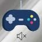

# The project goals

Provide a list of macros and programs to make gaming and every day use a little easier

Possible macros:

 Increae volume of currect game (or any application) 

 Decrease volume of currect game (or any application)

 Toggle muting of currect game (or any application)

 Increae volume of Discord

 Decrease volume of Discord

 Toggle muting of Discord

 Switch default sound to speakers

 Switch default sound to headphones
  
 Start/Stop Recording with Nvidia

 Record last X minutes with Nvidia (Use whatever the user has set)

Eco Mode - Lower Clock speed and RPM

Normal Mode - Defaults

High Performace Mode - Turbo Mode OC, Fans on full

Plex Server

Plex Client

Utorrent

Snippy

Open VPN Profiles (Build, Dev, PPE, Prod)

Reboot

Shutdown

Housekeeping (Close non-essential services)

Spotify start playlist

3rd party projects which may be useful:
  * http://www.nirsoft.net/utils/nircmd.html
  * https://autohotkey.com/ 
  * https://www.elgato.com/en/gaming/stream-deck
  * https://github.com/WElRD/StreamDeckCore - Maybe we can get some gif icons too!
